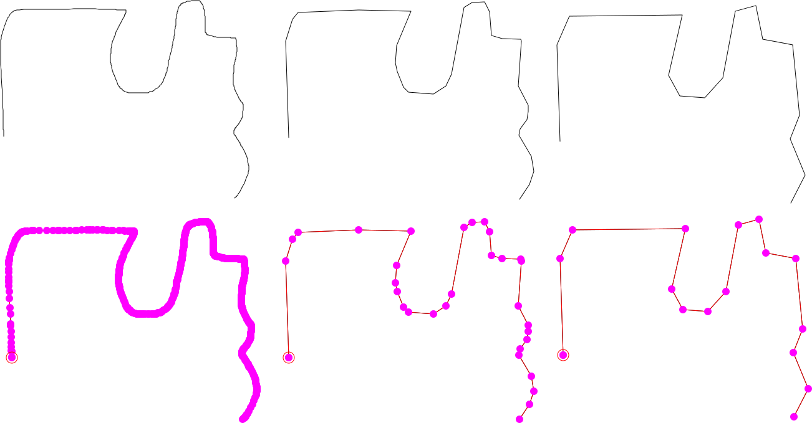

With the simplify ipelet, you can simplify a path in the sense that 
points that only a small number of points (based on the input 
tolerance) are kept. The following example illustrates a hand-drawn 
path and two simplifications of it.

 

# Download & Installation #

Download [simplify.lua](simplify.lua) and copy it to ~/.ipe/ipelets/
(or to some other directory for ipelets).

# Usage #

Run "Ipelets->Simplify Path->Simplify" to simplify the currently selected path.  

# Changes #

**12. April 2016**
first version of the simplify ipelet online