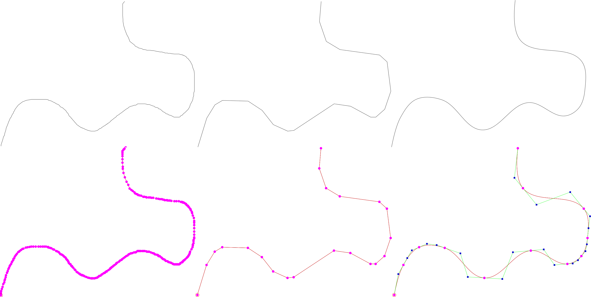

With the simplify ipelet, you can simplify a path in the sense that 
points that only a small number of points (based on the input 
tolerance) are kept while retaining the shape. The ipelet utilizes the 
[Ramer–Douglas–Peucker algorithm](https://en.wikipedia.org/wiki/Ramer%E2%80%93Douglas%E2%80%93Peucker_algorithm).
The user can choose whether he wants to simplify to a polygonal chain or
to a spline (a chain of cubic Bezier curves). The ipelet also gives an 
option to convert a polygonal chain into a spline.
The following example illustrates a hand-drawn path and two polygonal 
simplifications of it.

 

The second example illustrates a hand-drawn path, a polygonal simplification
with tolerance 5px, and a spline simplification with tolerance 10px.

 

# Download & Installation #

Download [simplify.lua](simplify.lua) and copy it to ~/.ipe/ipelets/
(or to some other directory for ipelets).

# Usage #

Run "Ipelets->Simplify Path->Simplify" to simplify the currently selected path.  
Run "Ipelets->Simplify Path->Simplify to Spline" to create a spline instead of a path. 

# Changes #

**12. April 2016**
first version of the simplify ipelet online