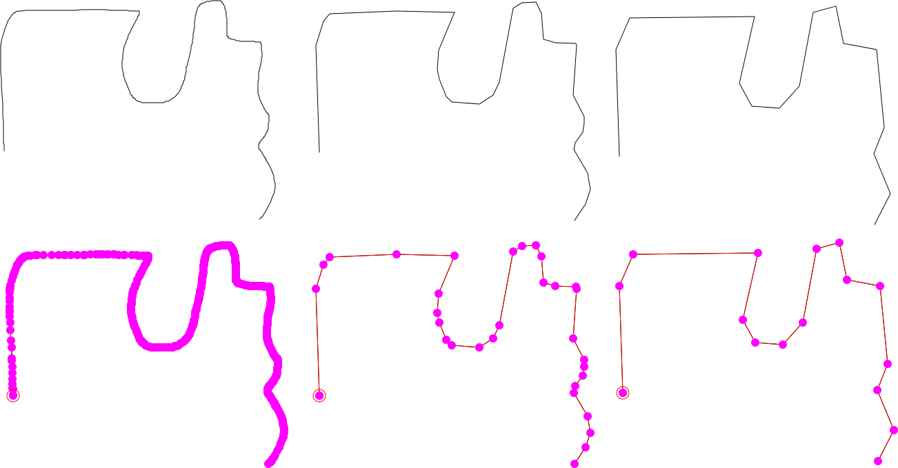
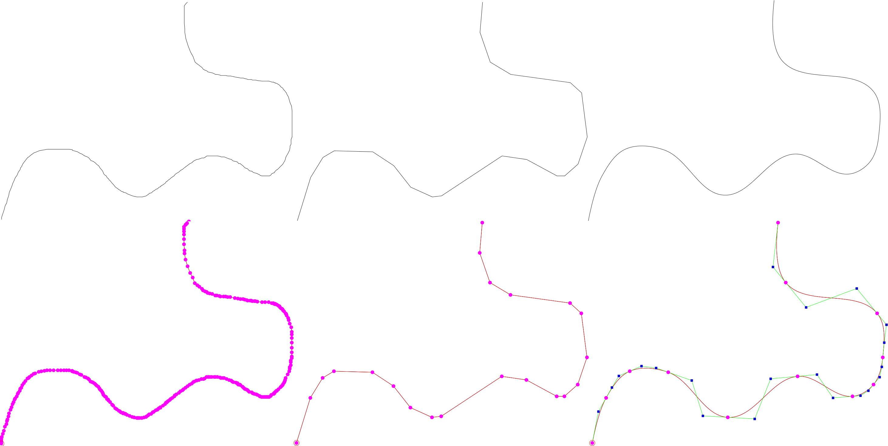

With the Simplify Ipelet, you can simplify a path in the sense that 
only a small number of points (based on the input tolerance) are kept 
while retaining the shape. The ipelet utilizes the 
[Ramer–Douglas–Peucker algorithm](https://en.wikipedia.org/wiki/Ramer%E2%80%93Douglas%E2%80%93Peucker_algorithm).
The user can choose whether to simplify to a polygonal chain or
to a spline (a chain of cubic Bezier curves). The ipelet also gives 
options to convert a polygonal chain into a spline and to round (and 
unround) the corners of a polygonal chain. All operations work on open 
and closed paths.

The following example illustrates a hand-drawn path and two polygonal 
simplifications of it.

 

The second example shows a hand-drawn path, a polygonal simplification
with tolerance 5px, and a spline simplification with tolerance 10px.

 

# Download & Installation #

Download [simplify.lua](simplify.lua) and copy it to ~/.ipe/ipelets/
(or to some other directory for ipelets).

# Usage #

Run "Ipelets->Simplify Path->Simplify" to simplify the currently selected path.  

Run "Ipelets->Simplify Path->Simplify to Spline" to create a spline instead of a path. 

Run "Ipelets->Simplify Path->Convert to Spline" to convert a path to a spline.

Run "Ipelets->Simplify Path->Set radius for round corners" to change the radius used for rounding (default: 4px).

Run "Ipelets->Simplify Path->Round Corners" to round the corners on a polyline.
Running it on an already rounded path re-rounds it with the current radius.
If an edge is too short for the radius, the radius at its corners is reduced
so that the roundings do not overlap.

Run "Ipelets->Simplify Path->Unround Corners" to turn a rounded polyline back
into a plain polyline, e.g., to move its vertices. Afterwards, round it again.

# Changes #

**12. April 2016**
first version of the Simplify Ipelet online

**13. April 2016**
added options to simplify and convert to a spline

**17. March 2022**
Added an option to round the corners of a polyline

**4. October 2026**
Operations now support closed paths. Added an option to unround the
corners of a polyline. Round Corners re-rounds already rounded paths, and
the radius is reduced on edges that are too short. Fixed handling of empty
input and of non-path objects in the selection.
